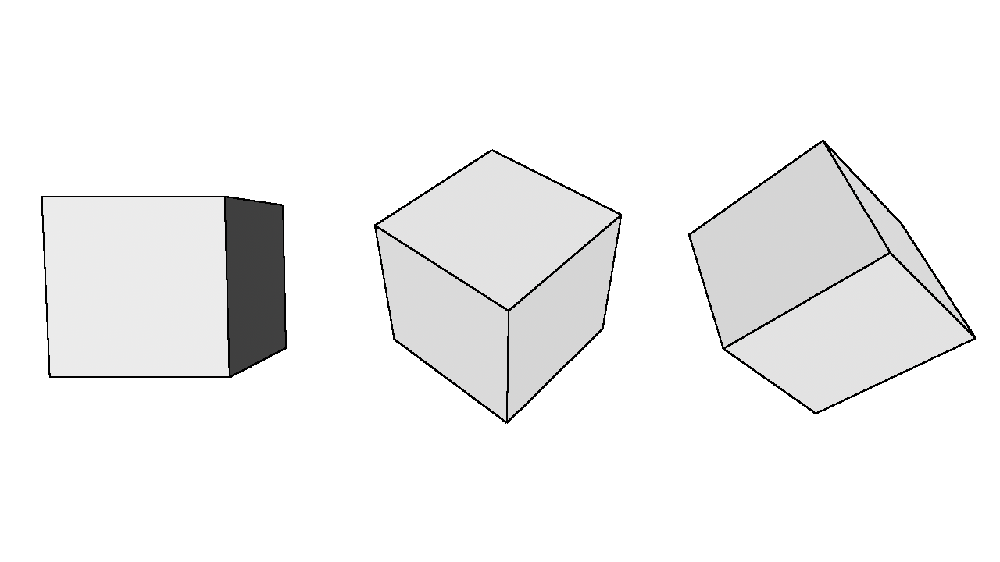
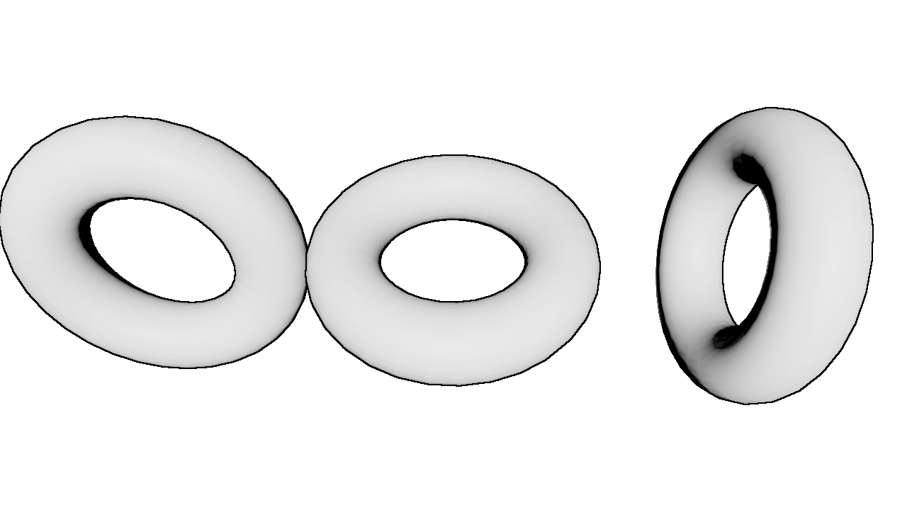

# grex_outline_post_process


A plugin for the [Bevy](https://bevyengine.org) engine which adds an outline post-processing effect.

Note: This is a full-screen post process effect and cannot be enabled/disabled for specific objects.

## Screenshots


Configuration Used:
```rs
grex_outline_post_process::components::OutlinePostProcessSettings {
    weight: 2.0,
    threshold: 0.0,
}
```
## Compatibility

| Crate Version | Bevy Version |
|---            |---           |
| 0.1           | 0.13         |

## Installation

### Using git URL in Cargo.toml
```toml
[dependencies.grex_outline_post_process]
git = "https://github.com/exvacuum/grex_outline_post_process.git"
```

## Usage

In `main.rs`:
```rs
use bevy::prelude::*;
use grex_outline_post_process;

fn main() {
    App::new()
        .add_plugins((
            DefaultPlugins,
            grex_outline_post_process::OutlinePostProcessPlugin,
        ))
        .run();
}
```

When spawning a camera:
```rs
commands.spawn((
    // Camera3dBundle...
    grex_outline_post_process::components::OutlinePostProcessSettings {
        weight: 2.0,
        threshold: 0.0,
    }
));
```

This effect will only run for cameras which contain this component.

